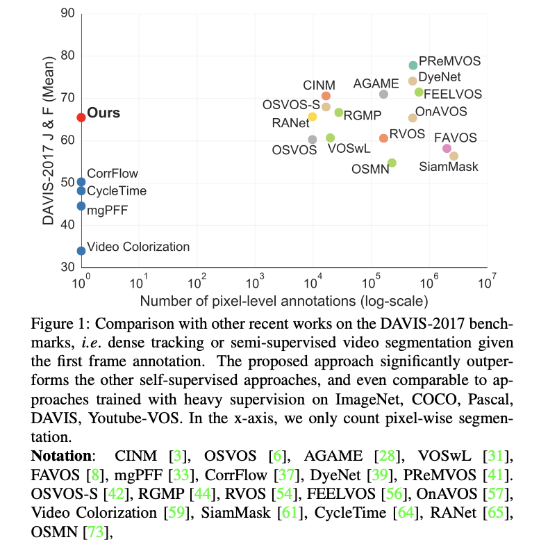
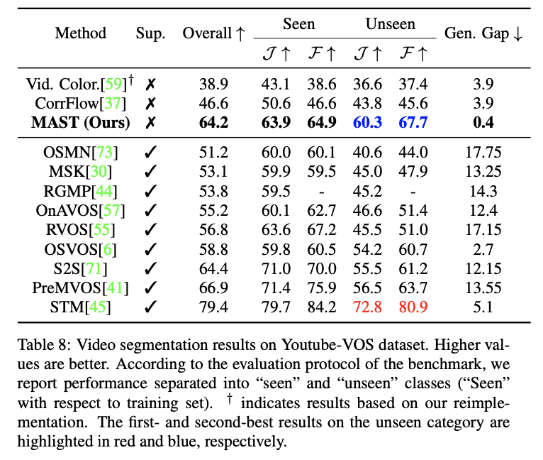
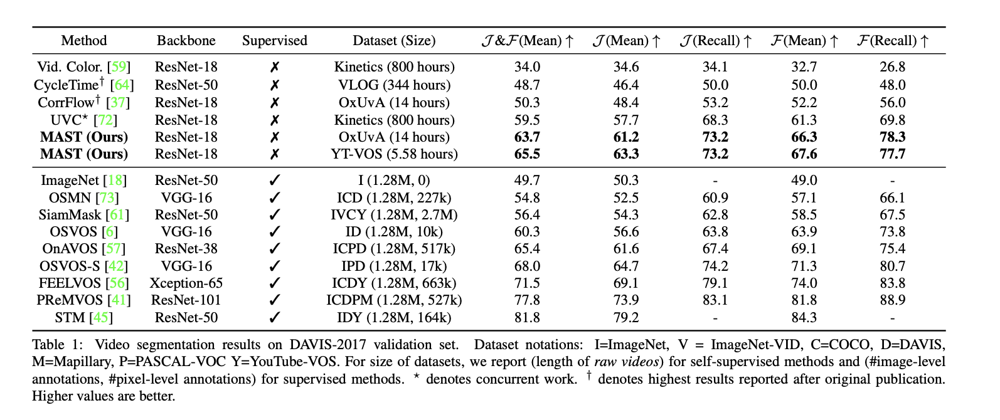

# MAST: A Memory-Augmented Self-supervised Tracker

This repository contains the code (in PyTorch) for the model introduced in the following paper

[MAST: A Memory-Augmented Self-supervised Tracker](https://arxiv.org/abs/2002.07793)


### Citation
```
@InProceedings{Lai20,
  author       = "Zihang Lai and Erika Lu and Weidi Xie",
  title        = "{MAST}: {A} Memory-Augmented Self-Supervised Tracker",
  booktitle    = "IEEE Conference on Computer Vision and Pattern Recognition",
  year         = "2020",
}
```

## Contents

1. [Introduction](#introduction)
2. [Usage](#usage)
3. [Results](#results)
4. [Contacts](#contacts)

## Introduction
Recent interest in self-supervised dense tracking has yielded rapid progress, but performance still remains far from supervised methods. We propose a dense tracking model trained on videos without any annotations that surpasses previous self-supervised methods on existing benchmarks by a significant margin (+15%), and achieves performance comparable to supervised methods. In this paper, we first reassess the traditional choices used for self-supervised training and reconstruction loss by conducting thorough experiments that finally elucidate the optimal choices. Second, we further improve on existing methods by augmenting our architecture with a crucial memory component. Third, we benchmark on large-scale semi-supervised video object segmentation(aka. dense tracking), and propose a new metric: generalizability. Our first two contributions yield a self-supervised network that for the first time is competitive with supervised methods on standard evaluation metrics of dense tracking. When measuring generalizability, we show self-supervised approaches are actually superior to the majority of supervised methods. We believe this new generalizability metric can better capture the real-world use-cases for dense tracking, and will spur new interest in this research direction.


## Usage
1. Install dependencies
    ``` 
    pip install -r requirements.txt
   ```
   
2. Download YouTube-VOS and DAVIS-2017 dataset. There is no need of pre-processing.
### Dependencies

- [Python3.7](https://www.python.org/downloads/)
- [PyTorch(1.1.0)](http://pytorch.org) **Note you need PyTorch 1.1 to get the correct training result.** We tried PyTorch 1.4 but it seems that the network fails to converge. Let me know if you know what might be the reason. Testing  seems fine under 1.4 though. 
- [Pytorch Correlation module (0.0.8)](https://github.com/ClementPinard/Pytorch-Correlation-extension) It appears that there are some problem with installing this module. I also failed to install it on one of my machines. Make sure you pass ```python check.py forward``` and ```python check.py backward``` (this code comes from the ClementPinard's github page) before training or testing.
- CUDA 10.0
- [OxUvA dataset](https://oxuva.github.io/long-term-tracking-benchmark/)
- [YouTube-VOS dataset](https://youtube-vos.org/)
- [DAVIS-2017](https://davischallenge.org/davis2017/code.html)

### Train
- Use the following command to train
    ```
    python main.py --datapath path-to-kinetics --savepath log-path
    ```

### Test and evaluation
- Use the following command to generate output for official DAVIS testing code
     ``` 
    python benchmark.py --resume path-to-checkpoint \
                    --datapath path-to-davis \
                    --savepath log-path
    ```
For benchmark the full model, you need a GPU with ~22G memory for the test. If that's not available to you, you could add a ```--ref 1``` to reduce memory usage to about 16G by using only 4 reference frames or ```--ref 2``` to reduce it to about <6G by only using 1 reference frame. The performance could drop by 5-10 points though. Another option would be downsample the input image. You could also change the code to process memories frame by frame, which could slow down the processing time but it should preserve the accuracy. 
 
- Then you can test the output with the official Python evaluation code.
    ```
    python evaluation_method.py \
                    --task semi-supervised \
                    --results_path log-path/benchmark
                    --davis_path your-davis-path
    ```
### Pretrained model 
[Google drive](https://drive.google.com/file/d/1vjiBdom75QzwCF5jnMRsxz897XyotVO8/view?usp=sharing)

### Results
Comparison with other methods on DAVIS-2017             |  Results on Youtube-VOS and Generalization ability
:-------------------------:|:-------------------------:
  |  

Video segmentation results on DAVIS-2017  |
:-------------------------:|
 |
